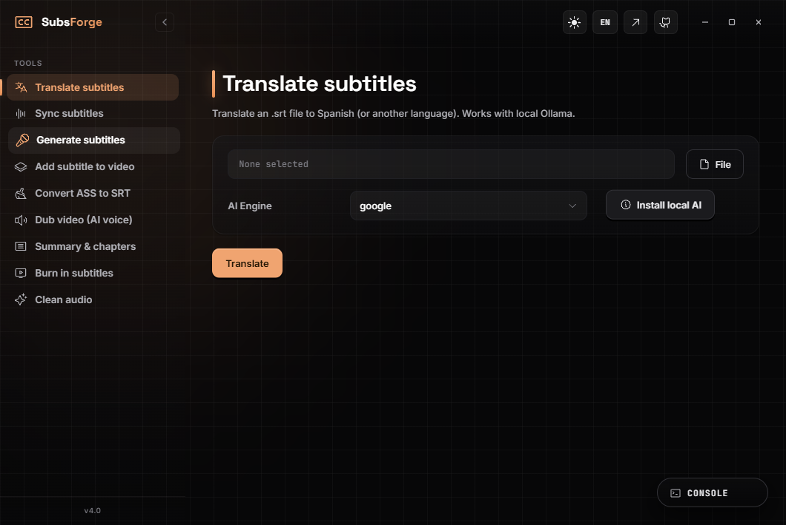

<p align="center">
  
</p>

<div align="center">

# SubsForge

**A desktop app to translate, generate, sync, merge, clean, dub, summarize and burn-in video subtitles with AI — fully local, with no third-party services and maximum privacy.**

[](LICENSE)
[](https://tauri.app)
[](https://www.rust-lang.org)
[](https://www.python.org)
[](https://ffmpeg.org)

</div>



## Features

- **Batch translation** — translate `.srt` files from any language into Spanish (or others) using the cloud or a local AI model (via **Ollama**).
- **Automatic generation (Whisper)** — extract the audio and transcribe videos with no subtitles using `faster-whisper`, optimized for CPU.
- **Smart sync (VAD)** — realign out-of-sync subtitles through voice-activity detection over the original audio, using `ffsubsync`.
- **Lossless merge** — remux subtitles into an `.mkv` container with FFmpeg in seconds, without re-encoding.
- **Style cleanup (.ass to .srt)** — convert complex anime subtitles into plain text compatible with any TV.
- **AI dubbing (TTS)** — generate a voice track with `edge-tts` and produce a dual-audio `.mkv`.
- **Summary and chapters** — a spoiler-free summary plus timestamped chapters from a subtitle file.
- **Hardsub and voice cleanup** — burn subtitles into the video, and isolate/clean the voice band with FFmpeg.
- **Bilingual UI** — a clean ES/EN interface with a real-time process log.

## Architecture

SubsForge uses a robust three-layer design communicating over **IPC (Inter-Process Communication)**, so heavy AI work never blocks the interface.

```mermaid
flowchart LR
    UI["Frontend<br/>(HTML/JS)"] -->|Events| Tauri["Tauri Middleware<br/>(Rust)"]
    Tauri -->|Spawn thread| Sidecar["AI Sidecar<br/>(Python)"]
    Sidecar -->|stdout (term-line)| Tauri
    Sidecar --> Whisper["faster-whisper"]
    Sidecar --> Sync["ffsubsync / FFmpeg"]
```

- **Frontend** — vanilla JS, lightweight and fully decoupled.
- **Backend bridge (Tauri / Rust)** — a fast, secure middleware that handles process orchestration and native OS capabilities.
- **AI sidecar (Python)** — a packaged engine (PyInstaller) responsible exclusively for the machine-learning work.

See the [technical documentation](docs/README.md) for the full design, the IPC contract and the tool reference.

## Requirements

- [Python 3.8+](https://www.python.org/) and [FFmpeg](https://ffmpeg.org/) on your system `PATH`.
- To build from source: [Node.js](https://nodejs.org/) and [Rust (Cargo)](https://rustup.rs/).

## Installation and local development

See the [Contributing guide](CONTRIBUTING.md) for full instructions on setting up the environment, building the Python AI engine and running the Tauri app.

```bash
git clone https://github.com/IvanjonasFC/SubsForge.git
cd SubsForge
```

## CI/CD

The repository ships full continuous integration. The [GitHub Actions workflow](.github/workflows/release.yml) builds the executable for **Windows, Linux and macOS** on every new release, compiling both the Python and Rust sides in the cloud.

## Project structure

```text
.github/        Templates, policies and CI/CD workflows (GitHub Actions)
assets/         Images, banners and screenshots
docs/           Contracts and technical documentation
src/
  webui/        Frontend (static vanilla-JS interface)
  core/         Python sidecar (AI, Whisper, sync)
src-tauri/      Rust backend (Tauri, IPC, window management)
```

## Documentation

- [ARCHITECTURE](docs/ARCHITECTURE.md) — system design, the three layers, the IPC model and data flow.
- [API](docs/API.md) — the two IPC boundaries: `invoke` commands and the sidecar CLI.
- [TOOLS](docs/TOOLS.md) — the nine tools: inputs, outputs, engines and generated files.
- [BUILD](docs/BUILD.md) — build the sidecar, package with Tauri and produce the installer.
- [OPERATIONS](docs/OPERATIONS.md) — security, permissions, logging and troubleshooting.

## Contributing and security

The project is open to the community. See the [Code of Conduct](CODE_OF_CONDUCT.md) and the [Security policy](SECURITY.md) for details.

## License

Distributed under the **MIT License**. See the [`LICENSE`](LICENSE) file.
