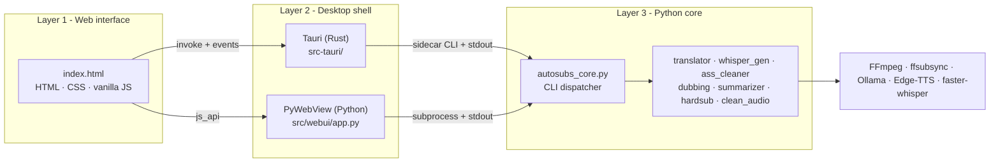
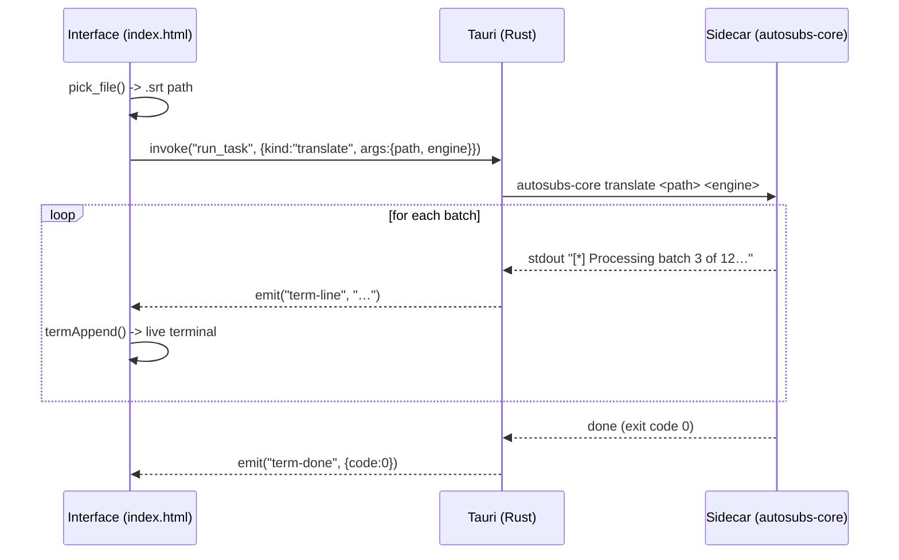

# Architecture

SubsForge splits the application into three independent layers that communicate
by messages. The design goal is that **heavy AI operations never block the
interface**, and that the same web interface runs unchanged under different
desktop shells.

## Overview

## Layer 1 — Web interface

A single `src/webui/index.html` file (HTML, CSS and JavaScript with no framework
or bundler) implements the whole interface: a custom title bar, a collapsible
sidebar, the nine tools, the live terminal, the language selector (ES/EN) and the
Ollama help modal. The design system (OLED palette `#050505`, accent
`#ff6b00 -> #ff3c00`, Space Grotesk / Inter / JetBrains Mono typefaces, grid and
glow) is the same one used in the author's portfolio.

### The environment bridge (BRIDGE)

The key piece is the `BRIDGE` object, which detects at runtime which shell it is
running under and exposes a uniform API. This lets the **same** `index.html` run
in three environments without scattered conditionals:

| Environment | Detection | Transport |
| --- | --- | --- |
| Tauri | `window.__TAURI__.core.invoke` | `invoke()` + `listen()` events |
| PyWebView | `window.pywebview.api` | async `js_api` calls |
| Demo (browser) | none of the above | in-memory mock data |

The rest of the interface code only calls `BRIDGE.run(...)`, `BRIDGE.pickFile()`,
and so on, and never knows which environment it lives in.

## Layer 2 — Desktop shell

There are two interchangeable implementations that satisfy the same contract
toward the interface:

- **Tauri** (`src-tauri/`, Rust) — the production target. Produces native
  installers, a decoration-less window with a custom bar, and runs the Python
  core as a *sidecar*. This is the recommended distribution path.
- **PyWebView** (`src/webui/app.py`, Python) — a lightweight, no-build
  alternative. Useful for fast development and for teams that only have Python.
  It uses the WebView2 (Edge) engine on Windows.

Both expose to the interface: window controls, URL opening, file/folder dialogs,
Ollama model detection and task launching with live output.

## Layer 3 — Python core

`src/core/autosubs_core.py` is a **CLI dispatcher**: it takes the task type as
its first argument (`translate`, `sync`, …) and delegates to the matching module.
Each module prints its progress to `stdout` line by line, with line buffering on,
so the shell can forward each line to the interface terminal in real time.

The modules reuse external libraries and binaries rather than reimplementing
anything: `faster-whisper` (transcription), `deep-translator` / Ollama
(translation and summary), `ffsubsync` (VAD sync), `edge-tts` (dubbing) and
`FFmpeg` (merge, hardsub, audio cleanup). `ffsubsync` and `ffmpeg` are invoked as
binaries on the `PATH` and are **not** bundled.

## Flow of a task (example: translate)

## Design principles

1. **Process isolation.** The AI runs in a child process; if it fails or stalls,
   the interface stays responsive. Communication is one-way over `stdout`.
2. **One source of truth for arguments.** The positional argument order of each
   task is defined identically in the sidecar, in `app.py` (`ARG_ORDER`) and in
   Rust's `run_task`. See [API.md](API.md).
3. **Interface portability.** Thanks to `BRIDGE`, switching shells does not touch
   the interface.
4. **No hidden system dependencies except FFmpeg.** What must be on the `PATH` is
   documented explicitly.
