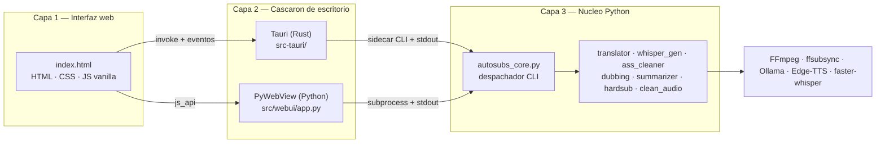
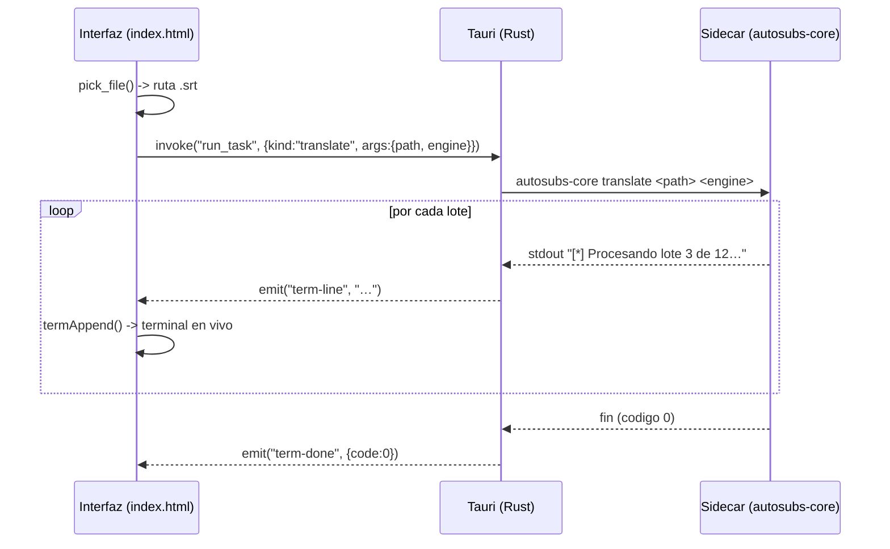

# Arquitectura

SubsForge separa la aplicación en tres capas independientes que se comunican
por mensajes. El objetivo de diseño es que **las operaciones pesadas de IA
jamás bloqueen la interfaz** y que la misma interfaz web funcione, sin cambios,
bajo distintos cascarones de escritorio.

## Vista general

## Capa 1 — Interfaz web

Un único archivo `src/webui/index.html` (HTML, CSS y JavaScript sin framework ni
bundler) implementa toda la interfaz: barra de título propia, barra lateral
plegable, las nueve herramientas, la terminal en vivo, el selector de idioma
(ES/EN) y el modal de ayuda de Ollama. El sistema de diseño (paleta OLED
`#050505`, acento `#ff6b00 → #ff3c00`, tipografías Space Grotesk / Inter /
JetBrains Mono, rejilla y halo) es el mismo que el del portfolio del autor.

### El puente de entorno (BRIDGE)

La pieza clave es el objeto `BRIDGE`, que detecta en tiempo de ejecución sobre
qué cascarón se está ejecutando y expone una API uniforme. Esto permite que el
**mismo** `index.html` funcione en tres entornos sin condicionales dispersos:

| Entorno | Detección | Transporte |
| --- | --- | --- |
| Tauri | `window.__TAURI__.core.invoke` | `invoke()` + eventos `listen()` |
| PyWebView | `window.pywebview.api` | llamadas `js_api` asíncronas |
| Demo (navegador) | ninguno de los anteriores | datos simulados en memoria |

El resto del código de la interfaz solo llama a `BRIDGE.run(...)`,
`BRIDGE.pickFile()`, etc., y nunca sabe en qué entorno vive.

## Capa 2 — Cascarón de escritorio

Hay dos implementaciones intercambiables que cumplen el mismo contrato hacia la
interfaz:

- **Tauri** (`src-tauri/`, Rust) — objetivo de producción. Genera instaladores
  nativos, ventana sin decoración con barra propia, y ejecuta el núcleo Python
  como *sidecar*. Es la vía recomendada para distribuir.
- **PyWebView** (`src/webui/app.py`, Python) — alternativa ligera y sin
  compilación. Útil para desarrollo rápido y para equipos que solo tienen
  Python. Usa el motor WebView2 (Edge) en Windows.

Ambos exponen a la interfaz: controles de ventana, apertura de URLs, diálogos de
archivo/carpeta, detección de modelos de Ollama y lanzamiento de tareas con
salida en vivo.

## Capa 3 — Núcleo Python

`src/core/autosubs_core.py` es un **despachador CLI**: recibe como primer
argumento el tipo de tarea (`translate`, `sync`, …) y delega en el módulo
correspondiente. Cada módulo imprime su progreso por `stdout` línea a línea, con
*line buffering* activado, de modo que el cascarón puede reenviar cada línea a la
terminal de la interfaz en tiempo real.

Los módulos reutilizan librerías y binarios externos en lugar de reimplementar
nada: `faster-whisper` (transcripción), `deep-translator` / Ollama (traducción y
resumen), `ffsubsync` (sincronización VAD), `edge-tts` (doblaje) y `FFmpeg`
(fusión, hardsub, limpieza de audio). `ffsubsync` y `ffmpeg` se invocan como
binarios del PATH y **no** se empaquetan.

## Flujo de una tarea (ejemplo: traducir)

## Principios de diseño

1. **Aislamiento de procesos.** La IA corre en un proceso hijo; si falla o tarda,
   la interfaz sigue respondiendo. La comunicación es unidireccional por `stdout`.
2. **Una sola fuente de verdad para los argumentos.** El orden posicional de los
   argumentos de cada tarea está definido igual en el sidecar, en `app.py`
   (`ARG_ORDER`) y en `run_task` de Rust. Ver [API.md](API.md).
3. **Portabilidad de la interfaz.** Gracias al `BRIDGE`, cambiar de cascarón no
   toca la interfaz.
4. **Sin dependencias ocultas del sistema salvo FFmpeg.** Se documenta
   explícitamente qué debe estar en el PATH.
